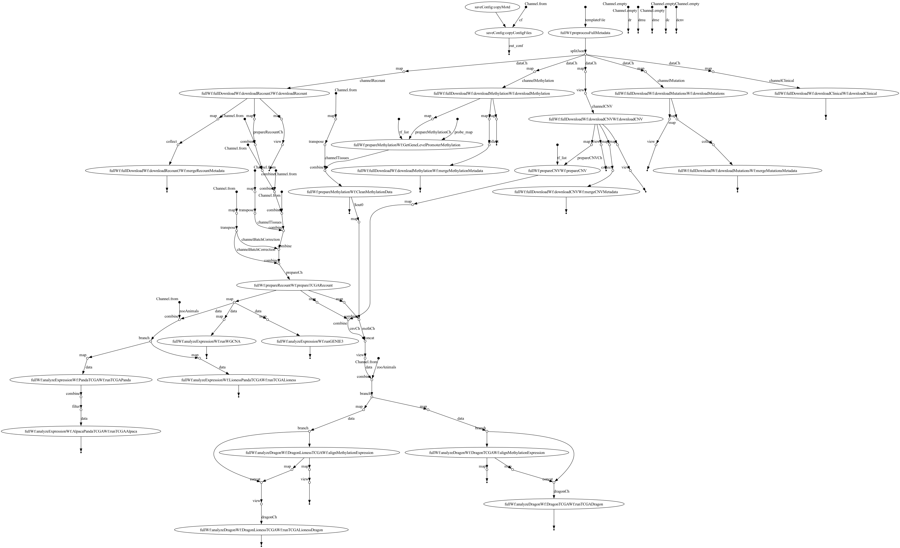
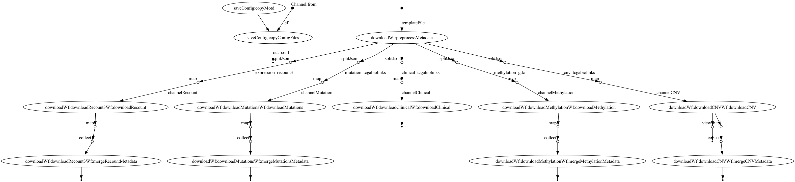
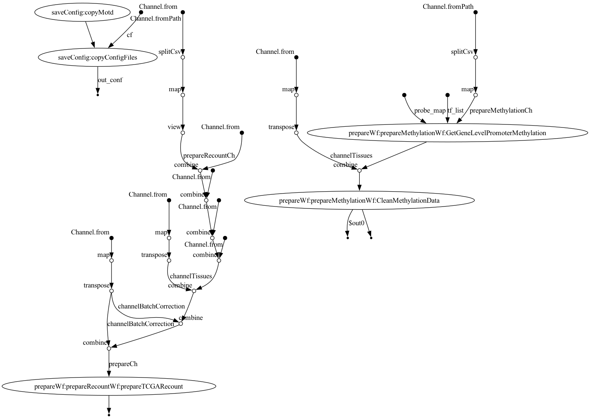
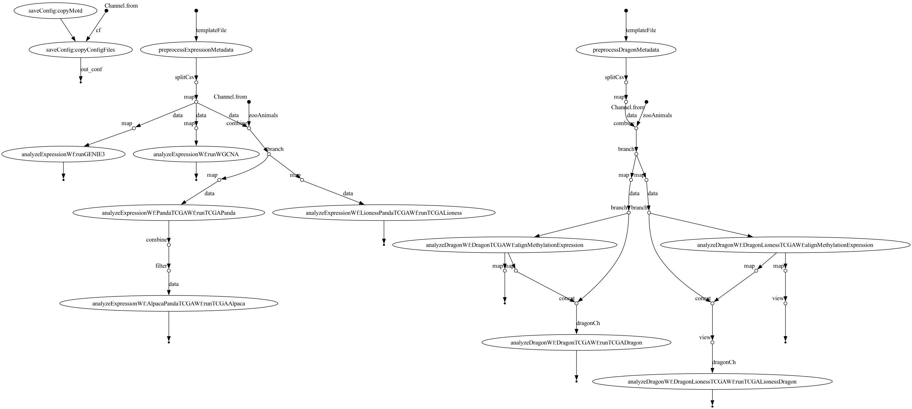

---
title:  Configurations
filename: docs.md
--- 

# Documentation tcga-data-nf 

## General Advice:

- The `testAnalyze` workflow is the fastest and easiest to use. Start from here.
- The `testDownload` is possibly the longest, although it should be straightforward. Beware that this worflow requires
  downloading a lot of data, which might be a problem on an unstable internet connection.


## Conda

Here are more details about conda. Each process uses a different environment, 
which helps with keeping environments separated and reduce possible conflicts.

The conda configurations are in `conda.conf`.

Here the process selectors labels:

Labels: 
- `merge_tables`: labels for all the merge metadata processes. Only requires python and pandas
- `r_download`: Label for all the download processes, they more or less all require the same packages. All r packages
  useful for download (TCGAbiolinks, recount3, nsdc, optparse, GenomicDataCommons, tidyverse). 
- `prepare_expression`: prepare recount data (ecount3, recount, data.table, readr (tidyverse))
- `prepare_methylation`: clean and prepare methylation ( data.table, nsdc, stringr(tiyverse), recount3, optparse)
- `netzoopy_panda`: run panda
- `netzoopy_dragon`: run dragon
- `netzoopy_pandalioness`: run pandalioness
- `netzoopy_dragonlionss`: run dragon lioness

For the netzoo functions we are keeping the selectors separated to allow
managing the GPU. Indeed, we recommend using a GPU to process LIONESS networks, 
but in that case the conda environment heavily depends on the cuda version, 
hence we recommend building the environment manually.

Also, for the moment there are some packages that need to be installed manually, 
which is managed by the process themselves. These packages are NetSciDataCompanion, 
...


For further instructions on how to use conda with nextflow 
and to specify your own configurations read the [nextflow
docs](https://www.nextflow.io/docs/latest/config.html#config-conda). 

## Docker

We have now switched to a docker without conda. In previous iterations we were relying on micromamba 
to install all packages, but we are now switching away from conda, as it seems to be giving issues to many institutions. 

You can pull the docker directly from [dockerhub](https://hub.docker.com/r/violafanfani/tcga-data-nf). 

`docker pull violafanfani/tcga-data-nf`

We have now added two partial containers to run the Download and Prepare steps. 

`docker pull violafanfani/tcga-data-nf-download:0.0.17`

and 

`docker pull violafanfani/tcga-data-nf-prepare:0.0.17`

This can be set using the labels, the same way it was described for conda.

## Tests

## Result folders

Here the structure of all the output folder, as they are created in the tests.
The UUID names in these will likely change for your own analysis, but the structure will 
remain the same. 


### Results: Download


```bash
⚡ tree results/test_download 
results/test_download
├── downloaded_methylation_metadata.csv
├── downloaded_mutation_metadata.csv
├── downloaded_recount_metadata.csv
├── gtex_pancreas
│   └── data_download
│       └── recount3
│           └── gtex_pancreas.rds
└── tcga_paad
    └── data_download
        ├── clinical
        │   ├── clinical_drug_paad.csv
        │   ├── clinical_follow_up_v4.4_nte_paad.csv
        │   ├── clinical_follow_up_v4.4_paad.csv
        │   ├── clinical_nte_paad.csv
        │   ├── clinical_omf_v4.0_paad.csv
        │   ├── clinical_patient_paad.csv
        │   └── clinical_radiation_paad.csv
        ├── methylation
        │   ├── tcga_paad_methylation_manifest.txt
        │   ├── tcga_paad_methylation_metadata.csv
        │   └── tcga_paad_methylations.txt
        ├── mutations
        │   ├── tcga_paad_mutations.txt
        │   ├── tcga_paad_mutations_metadata.csv
        │   └── tcga_paad_mutations_pivot.csv
        └── recount3
            └── tcga_paad.rds


```

### Prepare


This would be the output when you run the `-profile testPrepare` test case

```bash
results/test_prepare
└── tcga_paad
    └── data_prepared
        ├── methylation
        │   ├── tcga_paad_tf_promoter_methylation_clean_all.log
        │   └── tcga_paad_tf_promoter_methylation_raw.csv
        └── recount3
            ├── recount3_pca_tcga_paad_purity01_normtpm_mintpm1_fracsamples00001_tissueall_batchnull_adjnull.png
            ├── recount3_pca_tcga_paad_purity01_normtpm_mintpm1_fracsamples02_tissueall_batchnull_adjnull.png
            ├── recount3_tcga_paad_purity01_normtpm_mintpm1_fracsamples00001_tissueall_batchnull_adjnull.log
            ├── recount3_tcga_paad_purity01_normtpm_mintpm1_fracsamples00001_tissueall_batchnull_adjnull.rds
            ├── recount3_tcga_paad_purity01_normtpm_mintpm1_fracsamples00001_tissueall_batchnull_adjnull.txt
            ├── recount3_tcga_paad_purity01_normtpm_mintpm1_fracsamples02_tissueall_batchnull_adjnull.log
            ├── recount3_tcga_paad_purity01_normtpm_mintpm1_fracsamples02_tissueall_batchnull_adjnull.rds
            └── recount3_tcga_paad_purity01_normtpm_mintpm1_fracsamples02_tissueall_batchnull_adjnull.txt

```

### Analyze

This would be the output when you run the `-profile testAnalyze` test case

```bash
results/test_analyze
└── tcga_paad
    └── analysis
        ├── dragon
        │   ├── tcga_paad_dragon.log
        │   ├── tcga_paad_dragon_filtered_expression.csv
        │   ├── tcga_paad_dragon_input.tsv
        │   └── tcga_paad_dragon_mat.tsv
        ├── lioness_dragon
        │   ├── lioness_dragon
        │   │   ├── lioness-dragon-TCGA-2L-AAQL-01A.csv
        │   │   ├── lioness-dragon-TCGA-HV-A5A3-11A.csv
        │   │   ├── lioness-dragon-TCGA-HV-A7OP-01A.csv
        │   │   ├── lioness-dragon-TCGA-IB-A5ST-01A.csv
        │   │   ├── lioness-dragon-TCGA-US-A779-01A.csv
        │   │   └── lioness-dragon-TCGA-YB-A89D-11A.csv
        │   ├── recount3_tcga_paad_purity01_normtpm_mintpm1_fracsamples02_tissueall_batchnull_adjnull_shuffle.rds
        │   ├── tcga_paad_lioness_dragon.log
        │   ├── tcga_paad_tf_promoter_methylation_clean.csv
        │   └── tcga_paad_tf_promoter_methylation_clean_shuffle.csv
        ├── panda
        │   ├── panda_tcga_paad.log
        │   └── panda_tcga_paad.txt
        └── panda_lioness
            ├── lioness
            │   ├── lioness.TCGA-2L-AAQL-01A-11R-A38C-07.4.h5
            ...
            └── panda.txt
```

### Full 


Here is an example of the output of the full test.
`tcga_luad` is the uuid of the run , hence inside the `tcga_luad` folder you'll find all relevant files
divided in `data_download`, `data_prepare`, `analysis` folders, that correspond to the steps of the pipeline

Here the general out structure. Below we have the full expected output

```bash
results/test_full
└── tcga_luad
    ├── analysis
    │   ├── dragon
    │   ├── lioness_dragon
    │   │   └── lioness_dragon
    │   ├── panda
    │   └── panda_lioness
    │       └── lioness
    ├── data_download
    │   ├── clinical
    │   ├── methylation
    │   ├── mutations
    │   └── recount3
    └── data_prepared
        ├── methylation
        └── recount3
```


## Configurations

Here is a list of all available paramenters. 

#### General parameters

- `resultsDir = "results"`: general folder under which you want to find the results. This can directly reference an AWS S3 bucket
- `batchName = "my-batch"`: name of the run, this is gonna create a subfolder where the results are stored.
- `pipeline = 'download'`: name of the pipeline, one of download,prepare,analyze,full
- `logInfoFile = 'log-info.txt'`: general log file (many processes will have their own detailed log)

- `testDataFolder = "$baseDir/testdata"`: testdata folder, this shouldn't be changed by the user

#### Define metadata tables

Each file specifies a list of files or parameters to be used each workflow, 
for instance: which cancers and samples to download, what files need to be used 
in the pre-processing step...

You'll need to change only the one that concerns your pipeline. The others won't be used.

- `full_metadata = "$baseDir/testdata/conf/full_json.json"`: configuration file for the full pipeline

- `download_metadata = "$baseDir/testdata/conf/download_json.json"`: configuration file for the download pipeline


- `recount.metadata_prepare = "$baseDir/testdata/conf/prepare_recount_metadata.csv"`: configuration file for the
  expression files that need to be preprocessed

- `methylation.metadata_prepare = "$baseDir/testdata/conf/prepare_methylation_metadata.csv"`: configuration file for the
  methylation files that need to be preprocessed

- `metadata_expression = "$baseDir/testdata/conf/analyze_expression_metadata.csv"`: metadata file to be used with the
  analysis pipeline. This is gonna be the list of expression files used to generate networks
- `metadata_dragon = "$baseDir/testdata/conf/analyze_dragon_metadata.csv"`:  metadata file to be used with the
  analysis pipeline. This is gonna be the list of expression files used to generate DRAGON networks

#### Prepare expression parameters

These parameters are used to generate pre-processed data. This is useful both for the prepare
and the full pipelines.

We enable users to specify multiple values for each parameter, such that the final files will be the combination of all
different parameters. 

- `recount.norm =['tpm', 'cpm', 'logcpm', 'logtpm']`: RNAseq normalization, you can set as many as you want
- `recount.min_tpm=[1]`: minimum number of normalized counts that at least `recount.frac_samples` should have in order
  to not filter out the gene.
- `recount.frac_samples=[0.0001,0.2]`: minimum percentage of samples that should have at least `recount.min_tpm` in a
  gene, in order
  to not filter out the gene. For keeping all genes use the 0.0000001 value as 0 gives problems
- `recount.th_purity=[0.00001,0.5]`: purity threshold for the samples, samples with less purity than this value will be
  thrown out. For keeping all samples use the 0.0000001 value as 0 gives problems

- Names of the tissues that need to be separated. **It is important to specify at least one value for each of the
  cancer of interest, otherwise no analysis is gonna be run**
`
    tissues{
    tcga_luad = ['all', 'tumor', 'normal']
    tcga_blca = ['all', 'tumor', 'normal']
    }
    `. 
'all' keeps all samples, 'tumor' keeps only the tumoral samples (with barcodes <10), and 'normal' keep only the adjacent normal samples (with barcodes >10)

- Names of the column that needs to be used for batch correction. Please note, that we only found colorectal cancer
  (TCGA_COAD) that needs to be batch corrected. `batch_correction{
    tcga_coad = ['tcga.gdc_platform']
    }`


#### Prepare expression parameters

- `methylation.probe_map =
  "$baseDir/assets/450k_promoter_probe_map_TSS200_TSS0_one_probe_to_many_genes.csv"`: probe map to map
  probes to promoter regions. We have precomputed it, otherwise you can use the make-manifest.r function in the local
  assets [or look here](#make-probe-map).

- `methylation.tf_list = "$baseDir/assets/TF_names_v_1.01.txt" `: list of TF used to restrict the number of
  "genes" used. This is used mostly for the dragon analysis, where we need to subset the number of nodes.
- `methylation.levine_exclusion = 's3://projectstcga/data/raw-data/mapping/methylation/levine_gene_exclusions.csv'`

- `methylation.to_npn = 'FALSE'`: non parametric transformation
- `methylation.to_mval = 'TRUE'`: transform the betas to mvalues

#### Analysis parameters

  - `zoo.animals = ['panda','dragon','panda_lioness','dragon_lioness']`: netZoo animals

  - `zoo.motif = "$baseDir/testdata/other/test_motif_prior.txt"`: motif prior for PANDA
  - `zoo.ppi = "$baseDir/testdata/other/test_ppi.txt"`: PPI prior for PANDA
  - `zoo.panda_lioness = "--with_header --fmt h5 --computing cpu --precision single --mode_process intersection
    --save_single_lioness  --as_adjacency --ignore_final"`: all CLI parameters for PANDA LIONESS
- `zoo.panda = "--with_header --as_adjacency --mode_process intersection"`: all CLI parameters for PANDA 


#### Make probe map

This is the code inside the `make_manifest.r` file.

```
# Minimum working example of manifest creation
# This sources the Illumina 450k manifest, annotated to the
# HG38 genome build with gencode v36.
# This is from the public manifest resources here: https://zwdzwd.github.io/InfiniumAnnotation

library(NetSciDataCompanion)
my_friend = NetSciDataCompanion::CreateNetSciDataCompanionObject()

my_manifest = my_friend$mapProbesToGenes(probelist = NULL, # this is the default, and maps every probe in the manifest
                                         rangeUp = 200,
                                         rangeDown = 0)

write.csv(my_manifest,file="450k_manifest_TSS200_TSS0_one_probe_to_many_genes.csv")
```


## AWS

You can follow these steps to run the workflow on a new AWS EC2 machine. Please be aware that depending on the chosen
configuration you might have to tweak these steps. 

- Software image (AMI): Canonical, Ubuntu, 24.04, amd64 noble image
- Virtual server type (instance type): t2.xlarge
- Storage: 100GB


1. `sudo apt update` (recommended AWS)
2. Install java: `sudo apt install openjdk-21-jre-headless` (recommended AWS)
3. Install nextflow: `curl -s https://get.nextflow.io | bash`
4. Move nextflow to $PATH
5. Try to pull test workflow `nextflow run helloworld`
6. Pull workflow: `nextflow pull QuackenbushLab/tcga-data-nf`
7. Install docker: `sudo snap install docker`
8. Check docker installation `sudo docker run hello-world`.
You may need to log out and log back in to your session before the next steps will work.
9. Make docker available without sudo (add user to group): `sudo usermod -aG docker $USER`
10. Pull tcga-data-nf docker `sudo docker pull violafanfani:tcga-data-nf:0.0.14`, check latest version or that of
   interest (v0.0.14 is the current one, but could become obsolete)
   You should see something like
   ```
   Digest: sha256:9eeb5af611da38cdd3dfb76fc0b2173991a42cde2adad79456d59c9a99e2f703
  Status: Downloaded newer image for violafanfani/tcga-data-nf:0.0.14
  docker.io/violafanfani/tcga-data-nf:0.0.14
   ```
11.  Run a test: `nextflow run QuackenbushLab/tcga-data-nf -profile testPrepare,docker -with-docker violafanfani/tcga-data-nf:0.0.14`
  


## Visualize the workflows
Here are the Directed Acyclic Graphs of the four different pipelines.

To generate your own DAG image run: 
```
nextflow run . -c myconf.config -preview -with-dag flowchart.png
```

To generate flowcharts similar to those in the paper, use Mermaid (.mmd):

```
nextflow run . -c myconf.config -preview -with-dag flowchart.mmd
```

### Full flowchart
 

### Download flowchart
 

### Prepare flowchart
 

 ### Analyze flowchart
 

